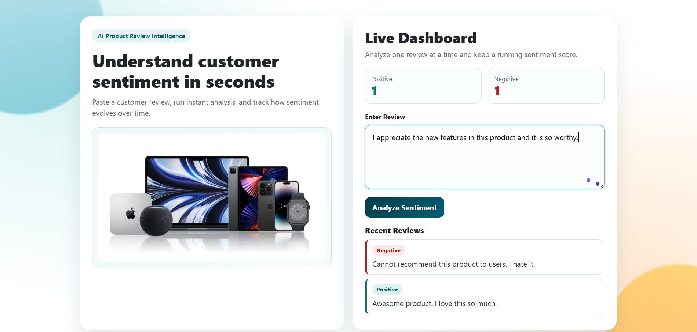

# Sentiment Analysis Project

Sentiment analysis uses Natural Language Processing (NLP) and Machine Learning techniques to identify the emotional tone in text. This project analyzes review text and classifies sentiment as **positive** or **negative**.

## Dataset

- Source: https://www.kaggle.com/datasets/dineshpiyasamara/sentiment-analysis-dataset/data
- Data file used in this project is stored in `artifacts/sentiment_analysis.csv` after download.

## Project Objective

Build an end-to-end sentiment analysis system that:

1. Trains and evaluates multiple machine learning models.
2. Selects a robust model based on evaluation metrics.
3. Exposes prediction through a Flask web application.

## End-to-End Workflow

### 1. Download Dataset

The dataset is downloaded from Kaggle and stored under the artifacts folder for preprocessing and model building.

### 2. Data Preprocessing

Basic data cleaning is performed before text processing:

1. Remove null or invalid records.
2. Normalize target labels.
3. Prepare train/test splits.

### 3. Text Preprocessing

Text is normalized to improve feature quality:

1. Converting uppercase to lowerce.
2. Remove Links
3. Punctuation and special character cleanup
4. Remove numbers
5. Stop-word removal
5. Stemming

### 4. Build Vocabulary

A vocabulary is created from cleaned text and saved for reuse during inference.

### 5. Vectorization

Preprocessed text is converted into numeric vectors suitable for machine learning models.

### 6. Handle Imbalanced Dataset

Class balancing is applied (for example, with oversampling/undersampling) to reduce bias and improve minority-class performance.

### 7. Model Building

The following models are trained and compared:

1. Logistic Regression
2. Naive Bayes
3. Decision Tree
4. Random Forest
5. Support Vector Machine (SVM)

### 8. Model Evaluation

Performance is measured using:

1. Accuracy
2. Precision
3. Recall
4. F1 Score

### 9. Build Prediction Pipeline

The prediction pipeline includes:

1. Input text collection.
2. Reuse of the same preprocessing steps from training.
3. Vectorization with saved vocabulary/vectorizer.
4. Final sentiment prediction using the selected model.

**Model Selection:** Logistic Regression was chosen as the final production model because it demonstrated the best validation performance and stable generalization across test data. While algorithms like Random Forest and SVM showed competitive training accuracy, they exhibited signs of overfitting. Logistic Regression offers a robust balance between accuracy and generalization, making it ideal for real-world sentiment prediction.

### 10. Build Web Application

A Flask-based web app is built to:

1. Accept user review text.
2. Predict and display sentiment.
3. Show sentiment counters and recent review history.

## Tech Stack

- Python
- Flask
- scikit-learn
- pandas
- NumPy
- NLTK
- HTML/CSS

## Project Structure

```
sentiment_analysis_project/
|-- app.py
|-- helper.py
|-- logger.py
|-- requirements.txt
|-- README.md
|-- artifacts/
|   |-- kaggle.json
|   |-- sentiment_analysis.csv
|-- static/
|   |-- css/
|   |   |-- main.css
|   |-- model/
|   |-- products/
|-- templates/
|   |-- index.html
|-- notebooks/
```

## How to Run Locally

1. Create and activate a virtual environment.
2. Install dependencies:

```bash
pip install -r requirements.txt
```

3. Start the Flask app:

```bash
python app.py
```

4. Open in browser: `http://127.0.0.1:5000`

## Final Application


